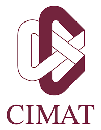

# Biología computacional
  

En este curso aprenderás un poco de biología computacional, adquirirás nociones de las herramientas linux, git, RAST y microreact.   

  
## Calendario   
  
<table>
    <tr>
        <td>Viernes 16       </td> <td></td>
  </tr>  
    <tr><td>                      16:00-16:20              </td>  
      <td> Introducción al genoma </td>
  </tr>
    <tr><td> 16:20 - 19:00 </td>
        <td>Explorando DNA's </td>
       </tr>
</table>  
      
    
## Informacion General  
Aqui puedes encontrar un [documento colaborativo](https://etherpad.net/p/compbio  ) donde compartiremos información relevante, links, y respuestas a preguntas que surjan durante el taller. 

## Temario detallado  
<table> 
<tr>
  <td> <b> 
1.0 <a href="paginas/linux/introduccion.html"> Introducción a la biología computacional</a>  </b>  
1.1 Introducción a la biología y genética molecular.  
<b> <a href="paginas/sesion2/algoritmos.md" >Algoritmos Biológicos </a> </b>   
1.3 Alineamiento   
1.4 BLAST   (16s)  
* 1.2 Ensamblado     
</td>

<td>
<a href="paginas/sesion3/basesDatos.md">Sesión 3</a>  Bases de datos, mapas y uso de paquetes de análisis</b>  
4.0 NCBI   
  <b> <a href="paginas/sesion6/arboles.md">Sesión 6 </a>Árboles y metadatos </b>    

  4.1 Crear un árbol a partir de un alineamiento     
   <a href="paginas/genomica/genomica.md"> Arboles y metadatos</a></td>
 </tr>
</table>    
     
___         
## Objetivo
El objetivo del taller será que los alumnos tengan un panorama general del uso del DNA para entender la diversidad.  
___  
  
## Instalaciones y requerimientos previos  
Se necesita acceso a un navegador con internet  
