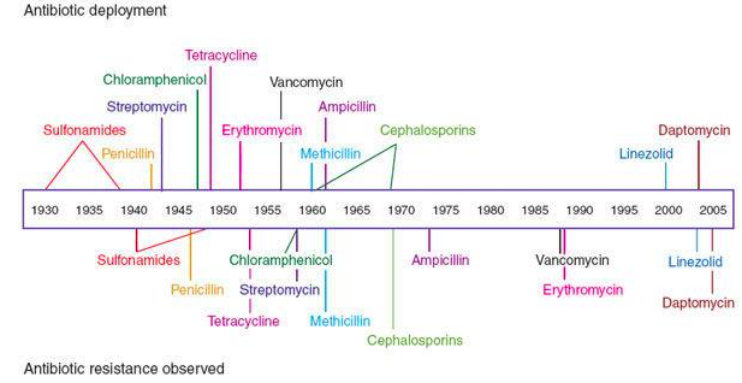

# Sesión 4 Bases de datos (30 min) 

## Introducción
Las bases de datos pueden ser públicas o privadas, acumulan información de los organismos y usualmente tienen algún paquete de análisis asociado a ellas. 

## Bases de datos públicas  
### [NCBI](https://www.ncbi.nlm.nih.gov/)  
NCBI es una de las grandes bases de datos biológicas. Hay información de genes, genomas proteínas, etc de muchos organismos.  
   

Esta secuencia del gen de 16s de _Streptomyces lividans_ proviene de NCBI  
>LC026160.1 Streptomyces lividans gene for 16S ribosomal RNA, partial sequence, strain: AS2
GGGGAGCTCTGCAGTCGACGATGACCACTTCGGTGGGGATTAGTGGCGAACGGGTGAGTAACACGTGGGC
AATCTGCCCTGCACTCTGGGACAAGCCCTGGAAACGGGGTCTAATACCGGATACTGACCCTCGCAGGCAT
CTGCGAGGTTCGAAAGCTCCGGCGGTGCAGGATGAGCCCGCGGCCTATCAGCTTGTTGGTGAGGTAATGG
CTCACCAAGGCGACGACGGGTAGCCGGCCTGAGAGGGCGACCGGCCACACTGGGACTGAGACACGGCCCA
GACTCCTACGGGAGGCAGCAGTGGGGAATATTGCACAATGGGCGAAAGCCTGATGCAGCGACGCCGCGTG
AGGGATGACGGCCTTCGGGTTGTAAACCTCTTTCAGCAGGGAAGAAGCGAAAGTGACGGTACCTGCAGAA
GAAGCGCCGGCTAACTACGTGCCAGCAGCCGCGGTAATACGTAGGGCGCAAGCGTTGTCCGGAATTATTG
GGCGTAAAGAGCTCGTAGGCGGCTTGTCGCGTCGGTTGTGAAAGCCCGGGGCTTAACCCCGGGTCTGCAG
TCGATACGGGCAGGCTAGAGTTCGGTAGGGGAGATCGGAATTCCTGGTGTAGCGGTGAAATGCGCAGATA
TCAGGAGGAACACCGGTGGCGAAGGCGGATCTCTGGGCCGATACTGACGCTGAGGAGCGAAAGCGTGGGG
AGCGAACAGGATTAGATACCCTGGTAGTCCACGCCGTAAACGGTGGGCACTAGGTGTGGGCAACATTCCA
CGTTGTCCGTGCCGCAGCTAACGCATTAAGTGCCCCGCCTGGGGAGTACGGCCGCAAGGCTAAAACTCAA
AGGAATTGACGGGGGCCCGCACAAGCGGCGGAGCATGTGGCTTAATTCGACGCAACGCGAAGAACCTTAC
CAAGGCTTGACATACACCGGAAAGCATCAGAGATGGTGCCCCCCTTGTGGTCGGTGTACAGGTGGTGCAT
GGCTGTCGTCAACTCGTGTCGTGAGATGTTGGGTTAAGTCCCGCAACGAGCGCAACCCTTGTCCCGTGGT
GGCCACCAGGCCCTTGGGGTGCTGGGGAACTCACGGGAAAACCGCCGGGGTCAAATCCGAAGGAAAGTGG
GGGACGACGTCAAAGTCTTCATTGCCCCTTATGGTCTTGGGCTGGCCACCGTGGCTACAAATGGCCCGGT
ACAAATGAACTTGCGATACCCGCCAGGGTGGAAGCGAAACCTCAAAAAGCCCGGTTCCAATTCCNGAATG
GGGGGCTTCGAACCTCACCCCCCTGGAAAGTCCGAGATCCCCTAGGAATCCGGAAATACCCATTTTGCGC
GGGGTAAAACATTTTCCCGCGGCCTTTTTTACACACGCCGCCCTTAAACTCTCAAGAAATTCTTGTACAC
CCCCCAGGAACCGGGTGGCCCCCACCCTCTTTTGGGGGAAGGGACTGTTCCCAAAGGTGGGGTTCCCGGC
ACTGGGGGGGGAATNGTTTTCCTCAAGAAGGTAA

#### Ejercicio 1    
Busca la taxonomía completa de _Streptomyces coelicolor_ en [NCBI taxonomy](https://www.ncbi.nlm.nih.gov/taxonomy).  

#### Ejercicio 2 
Utiliza [blastn](https://blast.ncbi.nlm.nih.gov/Blast.cgi?PROGRAM=blastn&BLAST_SPEC=GeoBlast&PAGE_TYPE=BlastSearch) para buscar como query el 16S de _Streptomyces lividans_ contra toda la base de NCBI. Guarda las cinco secuencias que mejor alineen (no 100% idéntica) en un formato fasta archivo de texto. La utilizaremos después para realizar un árbol.  

#### Ejercicio 3
Ve a NCBI y descarga el 16S de tu bacteria favorita. Anota el 16S aquí: [Documento colaborativov de 16s](https://docs.google.com/document/d/1LRmGY6wzyB9lnIbv3v9dF-DmTFzhTAjUaTAr6vZc5Uw/edit?usp=sharing). El encabezado con el nombre de la bacteria no debe llevar espacios, caracteres raros, ni pasar de 5o caracteres.

### [Árbol de la vida](http://tolweb.org/tree/)
En el árbol de la vida podrás explorar la diversidad de la vida.  

### [RAST](http://rast.nmpdr.org/rast.cgi)  
RAST es un anotador automático. Encuentra genes codificantes y les asigna función.  
Anota en RAST Streptomyces coelicolor y tu organismo ensamblado  
Compáralos  

### [MIBiG](https://mibig.secondarymetabolites.org)    
  
Obten la secuencia de un gen que pertenezca a un cluster de antibióticos y anótala en el documento colaborativo  

### [antiSMASH](https://antismash.secondarymetabolites.org/#!/start)
Anota rápidamente los genomas de Streptomyces y de tu ensamblado. ¿Qué diferencias ves? Anóta tu conclusión en el documento colaborativo.  

### [Kegg](https://www.genome.jp/kegg/),[Brenda](https://www.brenda-enzymes.org/), [pfam](https://pfam.xfam.org/)     
Busca HisA en ambas bases ¿Qué obtienes? 
Toma la secuencia de HisA y analízala en pFAM, qué obtienes? 

¿Cómo son tus organismos en RAST?  

### También existen bases de datos privadas  
[Clavigenomics](https://nselem.github.io/clavigenomics/) una base de datos de Clavibacter michiganensis Bacteria patógena de tomate.  
